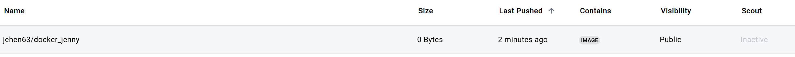
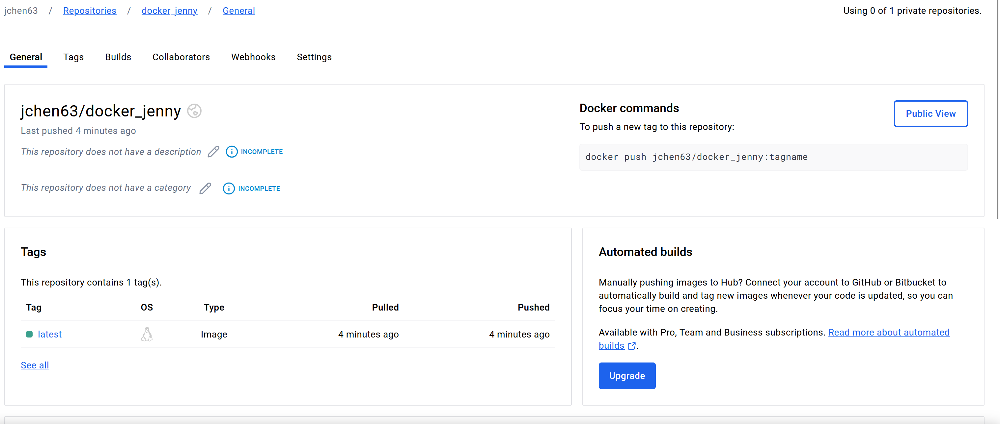
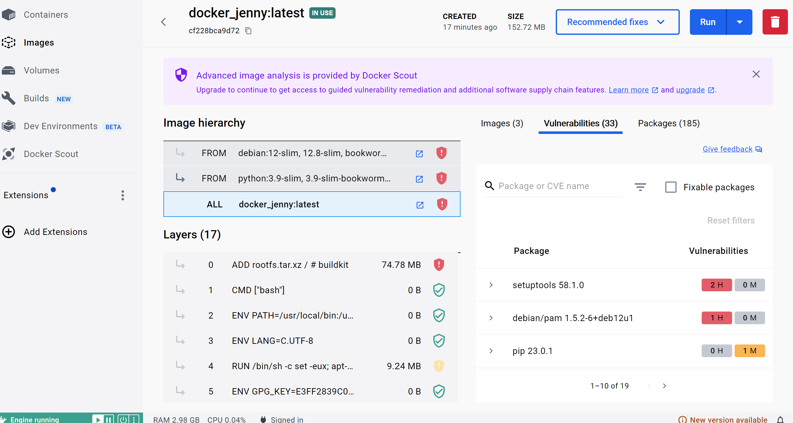
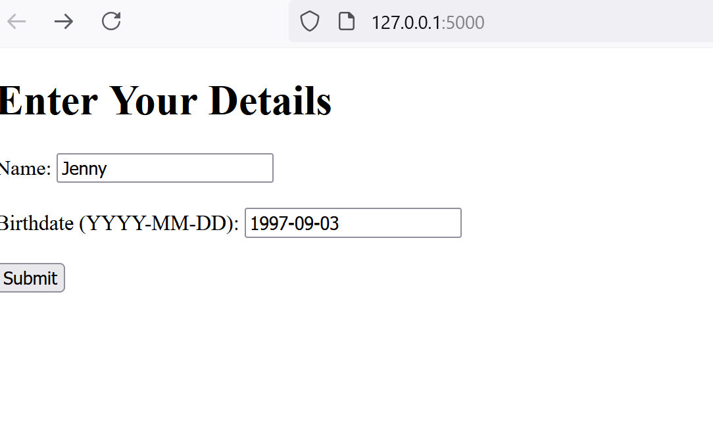
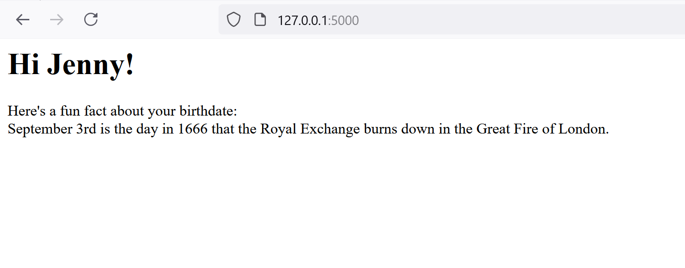

# Dockerized Application

The purpose of this project is to build an application using a Docker Container and creating an Image. The application was built using Flask and was pushed to DockerHub using make build and make push. 

## DockerHub

## Docker Image

## Web App
This web app gives users a fun fact about their birthdate. Users can input their name and birthday, after clicking "Submit", the page will return their name and a fact about their day of birth. The user interaction was built using HTML, the birthdate was parsed from YYYY-MM-DD datetime format to a string, and the fun fact was generated from [this numbers API](http://numbersapi.com/#random/date) site.  

## Environment
* requirements.txt 
* Dockerfile to set up Flask app and Docker 
* Makefile - to build the Docker image, run it, and push to Docker Hub
* github actions - yml file with Github secrets for Docker Hub in order to automate the build and run when pushed to Github

## Preparation and Running
1. Open codespaces 
2. Load repo to code spaces
3. Run `make build` to build the Docker image
4. Run `make run` to run the app
5. Run `make push` to push the image to Docker Hub

